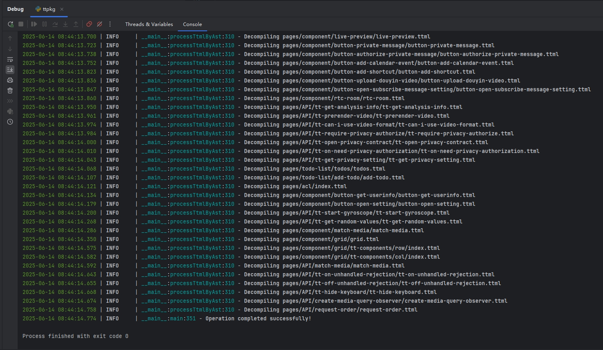

# ttpkgUnpacker 抖音小程序解包工具

> **注意**：目前暂不支持解包抖音小游戏的包。  
> 适用于文件开头为 `TPKG` 的抖音小程序包，支持 `.pkg` 文件和 `.ttpkg.js` 文件。



**解包原理**：可参考文章 [抖音小程序解包原理](https://www.52pojie.cn/thread-1684583-1-1.html)

## 功能列表
- ✅ 一键解包生成项目结构
- ✅ 提取 `ttss` 文件
- ✅ 提取 `ttml` 文件

## 依赖库
- `esprima`
  ```bash
  pip install esprima
  ```
## 使用帮助
### 命令行用法
```bash
# 解包单个 .pkg 文件
python ttpkg.py -i js/e2670a8.pkg -o output

# 解包 js 目录下所有 .pkg 文件
python ttpkg.py -i js/
```
### 命令行参数说明
```bash                  
usage: ttpkg.py [-h] -i INPUT [-o OUTPUT_FOLDER]

pkg文件路径

optional arguments:
  -h, --help            show this help message and exit
  -i INPUT, --input INPUT
                        输入pkg文件或文件夹 (e.g., 'js/e2670a8.pkg' or 'js/')
  -o OUTPUT_FOLDER, --output_folder OUTPUT_FOLDER
                        输出目录 (默认: 'output')
```

## 小程序包提取方法
 - root后的安卓手机（可用模拟器）
 - MT文件管理器
 - 抖音

1. 在手机上安装抖音，打开需要提取的小程序，**确保加载完成**后继续。
2. 使用`MT文件管理器`打开以下目录目录
```text
/data/data/com.ss.android.ugc.aweme/files/bdp/launchcache/
```
可以看到很多`appid_`开头的文件夹

> 
3. 点击右上角三个点，选择排序方式，按时间-逆向排序，确定
4. 最新打开的小程序对应的文件夹会排在第一个。进入该 `appid_` 文件夹，再进入以 `ver_` 开头的子文件夹，找到 `.pkg` 文件（分包情况下可能有多个 `.pkg` 文件）。
    > 提示：不确定是否为目标小程序？查看`.meta`文件可以看到小程序名称
   
5. 选择需要导出的`.pkg`文件复制到`/sdcard/`目录，然后微信或者qq分享。由于`/data/data/`目录需要root权限，其他程序无法直接访问，分享前需先复制到`/sdcard`。
    > ”替代方法：使用`adb`命令导出文件。“