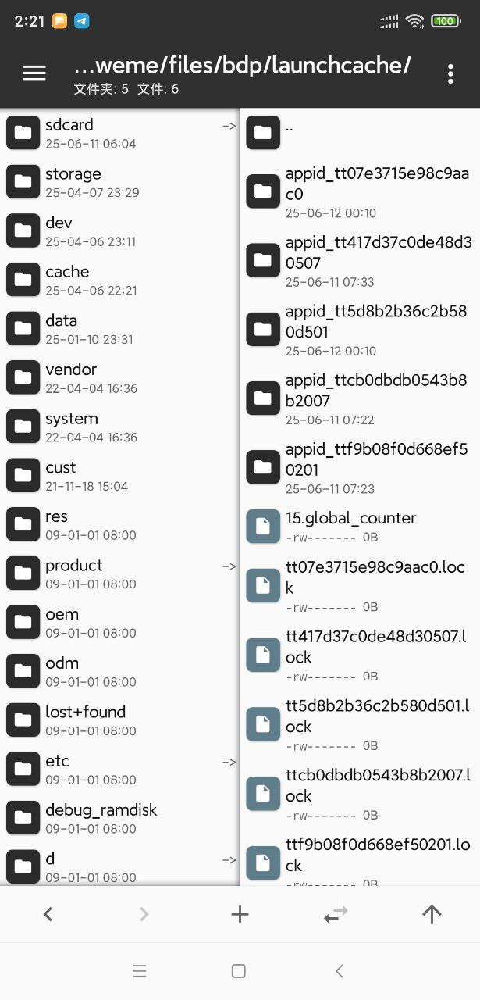
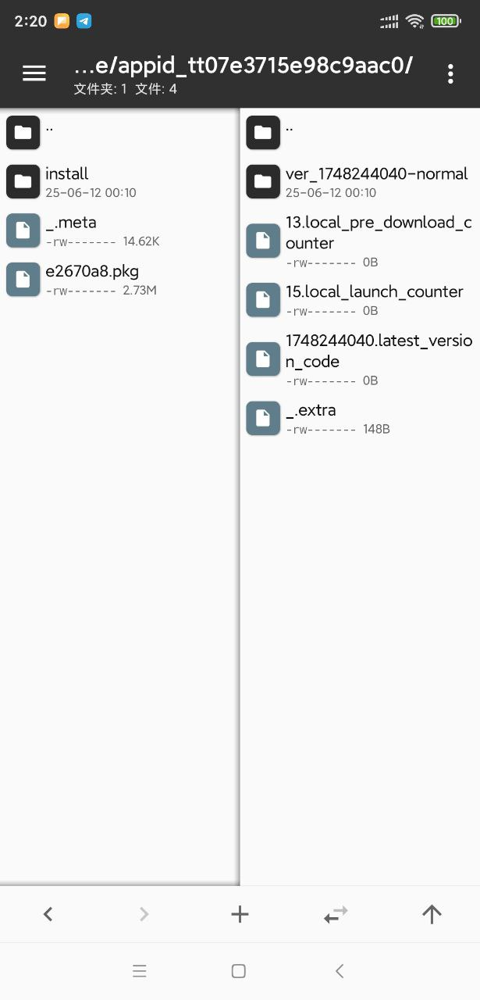

# ttpkgUnpacker 抖音小程序解包工具
<div style="color: red">ps:暂时还不能解抖音小游戏的包。</div>

抖音小程序解包工具（文件开头是TPKG开头的包），支持.pkg文件和.ttpkg.js文件

 > 解包原理可以看这篇文章 [https://www.52pojie.cn/thread-1684583-1-1.html](https://www.52pojie.cn/thread-1684583-1-1.html)
 
### 功能列表
 - [x] 一键解包成项目结构
 - [x] 提取ttss文件
 - [x] 提取ttml文件
## 依赖库支持
- esprima
> pip install esprima
## 项目运行
> python ttpkg.py -i js/e2670a8.pkg -o output

```bash                  
usage: python ttpkg.py [-h] -i INPUT_FILE [-o OUTPUT_FOLDER]

pkg文件路径

optional arguments:
  -h, --help            show this help message and exit
  -i INPUT_FILE, --input_file INPUT_FILE
                        输入pkg文件 (e.g., 'js/e2670a8.pkg')
  -o OUTPUT_FOLDER, --output_folder OUTPUT_FOLDER
                        输出目录 (默认: 'output')

```

## 小程序包提取方法
 - root后的安卓手机（可用模拟器）
 - MT文件管理器
 - 抖音

1. 在手机安装抖音并打开你要提取的小程序**并等待加载完毕**，然后继续下一步
2. 使用`MT文件管理器`打开目录`/data/data/com.ss.android.ugc.aweme/files/bdp/launchcache/`可以看到很多`appid_`开头的文件夹

   
3. 点击右上角三个点，选择排序方式，按时间-逆向排序，确定
4. 你刚打开的小程序就是第一个appid_开头的了，接着打开它，然后有个ver_开头的文件夹，再打开，里面就有`.pkg`文件了，有分包的会有多个`.pkg`文件

   
5. 选择你要导出的包，复制到`/sdcard/`目录下，然后现在才可以分享到微信或者qq。因为/data/data/目录其他程序没root权限没法访问到，所以会分享失败，或者你用adb导出，哈哈